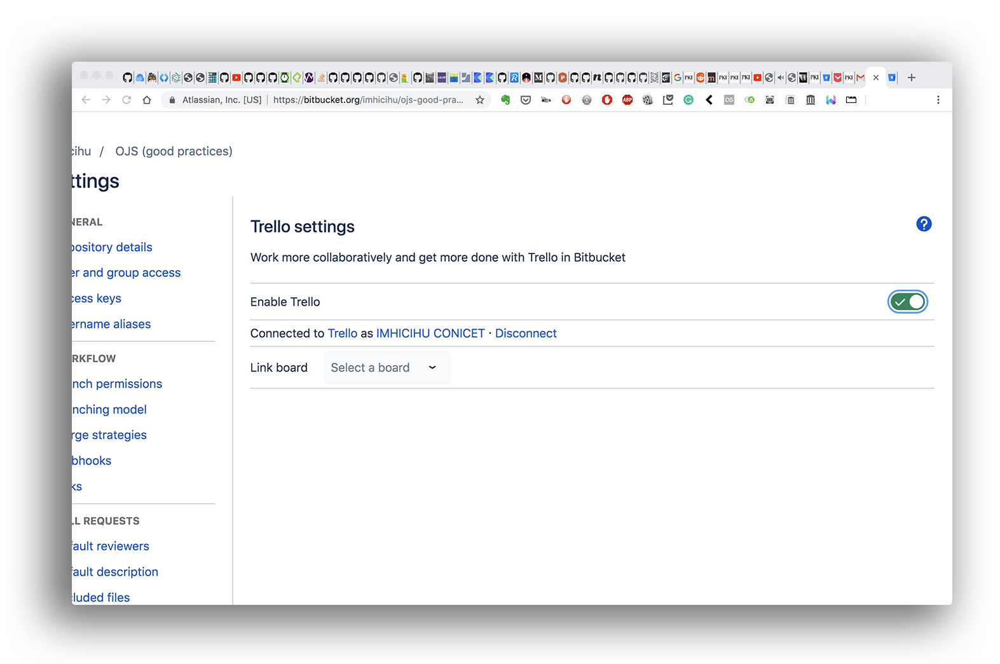
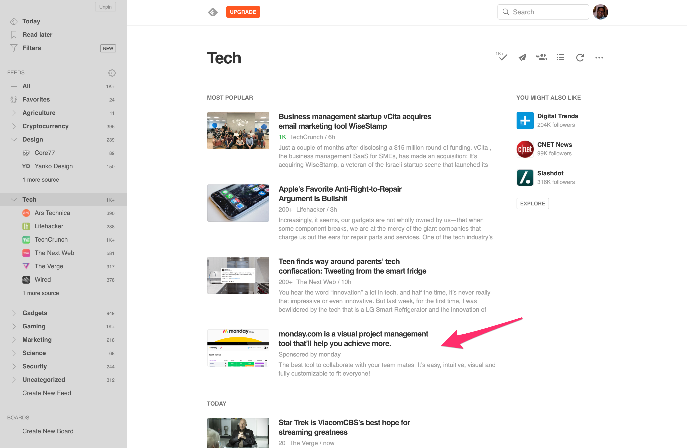

### Introduction
* This is a _bona-fide_ effort, as acts just a simple _checklist_. 
* It fills our needs, but in general, can sum a lot of time gained. Give it a try!

### Steps
* verify that your internet connection is running and stable
* create the repository in [Bitbucket](https://bitbucket.org/)
    - Give a name (the most descriptive name, the better)
    - choose if it will be a private or public repository
    - Choose `No` to a request of `Include a README?`
    - Version Control: `Git`
    - Give a `Description`
    - Choose what kind of `Forks` you will allow
    - Click on `Issue tracking` option
        - Choose between this options:
            + `No issue tracker`
            + `Private issue tracker`
            + `Public issue tracker`
                * append this legend: `Any issue will be handled on a best-effort basis All efforts have been made to keep the source as clean and readable as possible. //  Cualquier problema se manejará de la mejor manera posible. Se han realizado todos los esfuerzos para mantener la documentación y el código fuente lo más limpia y legible posible.`
            + Disable `Anonymous users can create issues` option
    - In `Language` choose the code language that it will be use (mostly)
    - Click on `Create repository`
* once created the repository, go to --> `Settings`, then `Repository details`
    - append an avatar
        - size: no more than 1Mb in size
        - file type allowed: `PNG`, `Gif` or `Jpeg`
    - go to --> `Settings`, then `Trello` section
        - Tap `Enable Trello`
        
        - Create a `Trello Board` according with the new repository created. Give the same name as repository
        - Inside this brand new board, enable `Public`. In `Labels` enable `Enable color blind friendly mode`
    - introduce a `Google Analytics key` in the option with the same name
* on `Settings` go to `Issue tracker`
    - Choose between: `No issue tracker`, `Private tracker` or `Public tracker`
* go the `Snippets` section. Choose language template according nature's project 
    - english  --> [`Template Colophon (English)`](https://bitbucket.org/snippets/imhicihu/4ep4g6/template-colophon-english)
    - spanish --> [`Plantilla Colofón (Español)`](https://bitbucket.org/snippets/imhicihu/xeMxGj/plantilla-colof-n-espa-ol)
* from `Snippets` section, create this files on the `Sources` section
    - [README.md](https://bitbucket.org/imhicihu/workspace/snippets/zea8aE/template-rationale-english)
    - [`.gitignore`](https://bitbucket.org/snippets/imhicihu/ak84yb/gitignore)
    - [`.editorconfig`](https://gist.github.com/imhicihu/795e211882cf690066c834dfe5419581)
    - [`.gitattributes`](https://gist.github.com/imhicihu/aa352d24aec82fd9e3cb017355afa7d4)
    - [`android.gitignore`](https://bitbucket.org/snippets/imhicihu/BMX8ja)
    - [`.hgtags`](https://stackoverflow.com/questions/4472804/what-is-the-purpose-of-having-hgtags)
* Then, create this files in the same section:
    - [`Colophon.md`](https://bitbucket.org/snippets/imhicihu/4ep4g6/template-colophonmd)
    - `To Do.md`
    - [`Bibliography.md`](https://bitbucket.org/snippets/imhicihu/xAMydX/bibliography-template)
    - `Links.md`
* create a first issue. Automatically it will generate a `RSS feed`. Copy the URL of the `RSS feed` and append to [Feedly](feedly.com). _Caveat_: This step form a part of an inner project. More info can be found [here](https://bitbucket.org/imhicihu/rss-feeds-self-tracking-control-of-repositories/overview)
  

* Choose which [license](https://choosealicense.com/) _fit_ the general purpose of the project:
    - [MIT License](https://bitbucket.org/snippets/imhicihu/Arozob/mit-license)
    - [Creative Commons Attribution 4.0 International Public License](https://bitbucket.org/snippets/imhicihu/qnzz7q/creative-commons-legal-documentationmd)
* If a repository is renamed, update the rss feed and urgently go to Feedly to update this new condition (see below). _Caveat_: This step form a part of an inner project. More info can be found [here](https://bitbucket.org/imhicihu/rss-feeds-self-tracking-control-of-repositories/overview)
  

* verify all the links with this online [tool](https://www.deadlinkchecker.com/)
* Host most of digital assets as possible: `.jpeg`, `.gif`, `.png`, `.svg` either Bitbucket or Github
