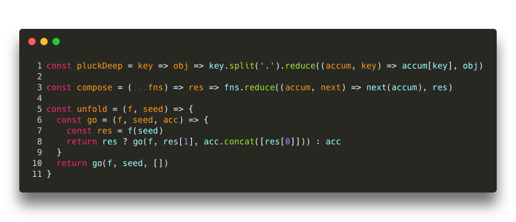
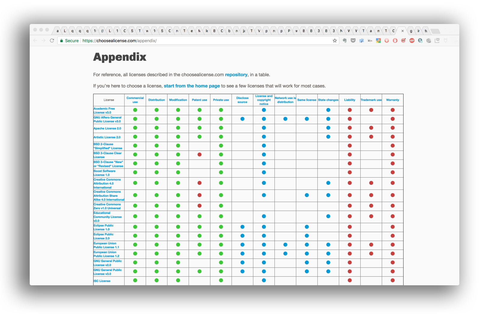
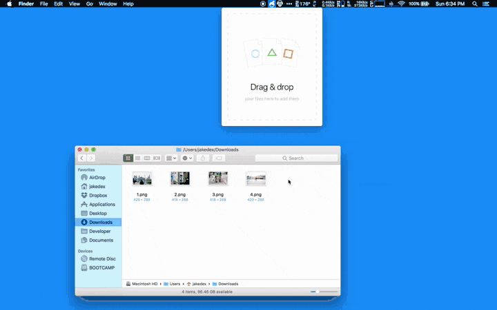

### Software

* Code documentation
	 - [Devdocs.io](https://devdocs.io/): Supports `localstorage` mode
* Syntax & semantic issues
	 - Install [Writefull for Chrome](https://chrome.google.com/webstore/detail/writefull/aolaabonkiegkggfdgjjehchjmjfanng/related): gives feedback on your writing by checking your text against databases of correct language
	 - Install [Grammarly for Chrome](https://chrome.google.com/webstore/detail/grammarly-for-chrome/kbfnbcaeplbcioakkpcpgfkobkghlhen): makes sure everything you type is clear, effective, and mistake-free
* Documentation (markdown online editor)
	 - [Writeme](http://writeme.mattstow.com/)
	 - [markdownify](http://www.amitmerchant.com/markdownify-web)
	 - [Hashify](http://hashify.me)
	 - [Dillinger](https://dillinger.io)
* Table generator (markdown)
	 - [Tables generator](https://www.tablesgenerator.com/markdown_tables)
	 - [Table convert](https://tableconvert.com/)
* Documentation (online hosting)
	 - [GitBook](https://www.gitbook.com/)
	 - [Read the docs](https://readthedocs.org/)
	 - [Mkdocs](http://www.mkdocs.org/)
* Diagram creation tools:
   - [Websequencediagrams](https://www.websequencediagrams.com/)
	 - [Draw.io](https://www.draw.io/)
	 - [js-sequence-diagrams](https://bramp.github.io/js-sequence-diagrams/)
	 - [flowchart.js](http://flowchart.js.org/)
* Animations on css
	 - [Animate.js](https://github.com/juliangarnier/anime/): css animations
* Pull requests (cleanliness method)
	 - [Houndci](https://houndci.com/)
* Optimizer & web performance
     - [sitespeed.io](https://www.sitespeed.io/): performance & optimization web tools
* Code editor
	 - [Aquamacs Emacs](http://aquamacs.org/download-release.shtml): Editor for Text, HTML, LaTeX, C++, Java, Python, R, Perl, Ruby, PHP, and more...
	 - [Atom Editor](http://atom.io)
* Code formatting
	 - [Prettier](https://prettier.io)
* Table of content generator (TOC)
	 - [gh-md-toc](https://github.com/ekalinin/github-markdown-toc): markdown (mostly _de facto_ format in Github & Bitbucket for internal documentation)
* Screen recorder:
	 - [Kap](https://getkap.co/)
	 - [LICEcap](https://www.cockos.com/licecap/)
* Font management:
     - [FontBase](https://fontba.se/)
* Local server environment on MacOSX
     - [Mamp](https://www.mamp.info)
     - [httpster](https://github.com/SimbCo/httpster)
* Video-tutorials:
	 - [Streamable](https://streamable.com/)
* HTLM 2 pdf
	 - [HTML2PDF](https://wkhtmltopdf.org)
* Terminal recorder:
   - [Asciinema](https://asciinema.org/)
* Code sharing:
	 - [Carbon](https://carbon.now.sh/): (Automatization on code screen sharing)
	 
	 - This is our [custom preset](/downloads/carbon-config.json)
* Bibliographic searcher
     - [ScienceFair](https://github.com/sciencefair-land/sciencefair): Discover, collect, organise, read and analyse scientific papers
	 - [Semantic Scholar](https://www.semanticscholar.org/)
* Code of conduct:
	 - [Contributor Covenant](https://www.contributor-covenant.org/): Code of Conduct for open source projects
* Code convention
	 - _Vide_ [code convention](https://bitbucket.org/imhicihu/good-practices-on-repository-creation/src/master/code_convention.md)
	 - Check our [pull request style guide](https://bitbucket.org/snippets/imhicihu/qnzLKk/pull-request-style-guides)
* Accessibility
	 - [Colorblindly](https://chrome.google.com/webstore/detail/colorblindly/floniaahmccleoclneebhhmnjgdfijgg): Chrome extension that simulates colorblindness in a web browser
	 - [Toptals Colorblind Web Page Filter](https://www.toptal.com/designers/colorfilter)
	 - [Colour Contrast Analyser](https://github.com/ThePacielloGroup/CCAe/releases/tag/v1.0.0)
	 - [Tanaguru contrast finder](https://github.com/Tanaguru/Contrast-Finder)
	 - [Color Oracle](https://colororacle.org/): a free color blindness simulator for Windows, Mac and Linux
	 - [Sim Daltonism](https://michelf.ca/projects/sim-daltonism/): color blindness simulator
* License status
	 - [Choosing an Open Source License](https://blog.github.com/2013-07-15-choosing-an-open-source-license)
	 - [Choose a license](https://choosealicense.com)
	 - [The MIT License (MIT)](https://mit-license.org/)
	 - [MIT License generator](https://www.richie-bendall.ml/mit-license-generator/): Generate your own MIT License
	   
	 - [Github OSS license](https://github.com/github/choosealicense.com)
	 - [Open source licenses](https://opensource.org/licenses)
	 - [Creative Commons licenses -kind-of](https://creativecommons.org/choose)
	 - [Comparison of free and open-source software licenses](https://en.wikipedia.org/wiki/Comparison_of_free_and_open-source_software_licenses)
	 - [Open Source Licenses Comparison Guide](https://itsfoss.com/open-source-licenses-explained)
	 - [Software Licenses in Plain English](https://tldrlegal.com)
	 - [Unlicense](https://unlicense.org/): set your code free
* Readability
	 - [Readability formulas](https://en.wikipedia.org/wiki/Readability#Popular_readability_formulas)
	 - [readable.io](https://app.readable.com/text/?demo)
	 - [Get your document's readability and level statistics](https://support.office.com/en-us/article/get-your-document-s-readability-and-level-statistics-85b4969e-e80a-4777-8dd3-f7fc3c8b3fd2?ui=en-US&rs=en-US&ad=US)
* Metadata (Dublin Core & XMP specifications)
     - [calibre](https://calibre-ebook.com): indexing and metadata verifier
     - [Skim](https://skim-app.sourceforge.io) PDF reader and note-taker for macOSX. It is designed to help you read and annotate scientific papers in PDF file format
* PDF assembly
     - [Alchemy](https://github.com/dawnlabs/alchemy): file converter and merger (mainly to merge lots of pdfs into one)
     <BR></BR>
     
* HTTPs:
     - [SSL for free](https://www.sslforfree.com/): Free SSL Certificates & Free Wildcard SSL Certificates
* Link checker:
     - [html-proofer](https://github.com/gjtorikian/html-proofer): outer html links checker
	 - [Dead link checker](https://www.deadlinkchecker.com/)
* Table converter
     - [Table convert](https://tableconvert.com/): converter to a plethora of formats
* Graphics:
     - [Gimp](https://www.gimp.org/) (graphics manipulation / editor)
     - [Image Shrinker](https://github.com/stefansl/image-shrinker): minify images and graphics 

### Online resources

* Image compressor
	 - [Sqoosh](https://squoosh.app/): Google's 'techie' response
* Graphic badges
	 - [For the badge](https://forthebadge.com/)
* Linter
     - [WebHint](https://github.com/webhintio/hint): improve your site's accessibility, speed, cross-browser compatibility, and more by checking your code for best practices and common errors
* Text readability
	 - [Abrevio](https://abrev.io/): en español
* Documentation
     - [Developer certificate](https://developercertificate.org/)
	 - [Markdown snippets Bitbucket](https://bitbucket.org/tutorials/markdowndemo)
	 - [Markdown snippets GitHub](https://guides.github.com/features/mastering-markdown/)
	 - [John Gruber's original markdown syntax](https://daringfireball.net/projects/markdown/syntax.text)
* GIF treatment
	 - [Ezgif](https://ezgif.com/): ```.gif``` optimization and resizing
* Online links checkers
	 - [html-proofer](https://github.com/gjtorikian/html-proofer): outer html links checker 
	 - [LinkChecker](https://www.deadlinkchecker.com/)
* Markup validator
     - [Markup Validation Service](https://validator.w3.org/#validate_by_input)
* Random Byte Generator
	 - [Random Byte Generator](https://www.random.org/bytes/)
