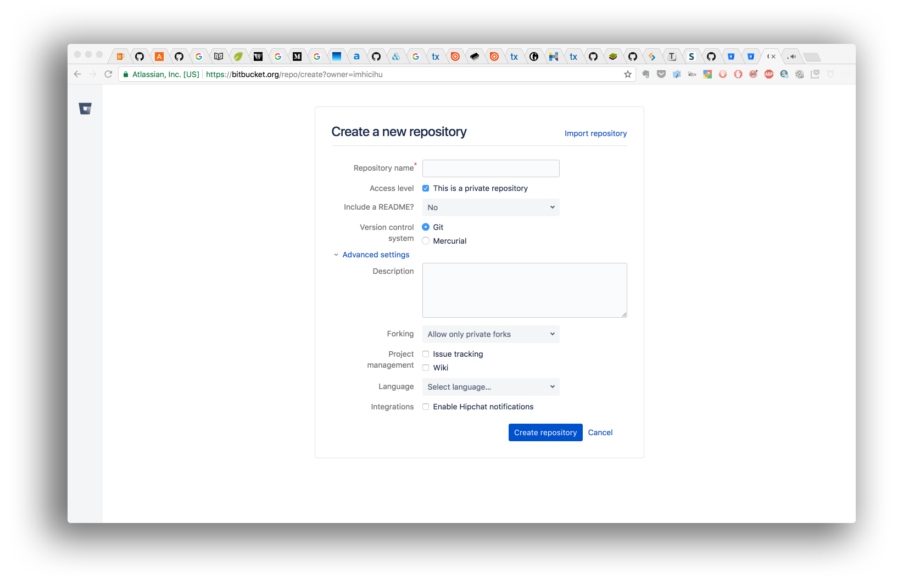

  

---

# FUNDAMENTO #

* El propósito de este repositorio es una forma de lista de control cuando creamos un nuevo repositorio
* Este repositorio es un documento vivo que crecerá y se adaptará con el tiempo

### ¿Cuál es la razón de ser de este repositorio? ###
* Breve resumen
  - Una receta de tipo _lista_de_sistematización_ cuando se crea un repositorio

### ¿Cómo se configura?
* Resumen de la configuración
  - Lea nuestra última [lista de verificación](Checklist_4_Bitbucket.md)
  - Estos son algunos [fragmentos de código](https://bitbucket.org/imhicihu/workspace/snippets/) creados para la ocasión
  - En algún momento, crearemos un [hito](https://jira.atlassian.com/browse/BCLOUD-11528). Y luego, mejorar el camino andado
  
* Dependencias
  - _Cuanto menos, mejor_. Un [lema](https://dictionary.cambridge.org/es/diccionario/ingles/motto) personal
* Instrucciones de implementación
  - No es un "_siga nuestras instrucciones_" obligatorio. Es un ejercicio de "_buenas prácticas_" y sigue nuestras necesidades

### Lineamientos de contribuciones
* Pruebas de escritura
  - [Bifurque](https://es.wikipedia.org/wiki/Bifurcaci%C3%B3n_(desarrollo_de_software) este repositorio. Abra una [solicitud de mejora](https://www.wikidata.org/wiki/Q68712963) o simplemente comente el flujo de trabajo descrito. Comprueba nuestra [convención de código](Coding_convention.md)
* Revisión de código fuente
  - 
* Otras guías
  -

### ¿Cómo puede contactarnos?
* Administrador del repositorio
    - Contáctese con `imhicihu` arroba `gmail` punto `com`
   
### Legales
* Todas las marcas registradas son propiedad de sus respectivos propietarios

### Licencia
* El contenido de este proyecto está bajo una licencia 
