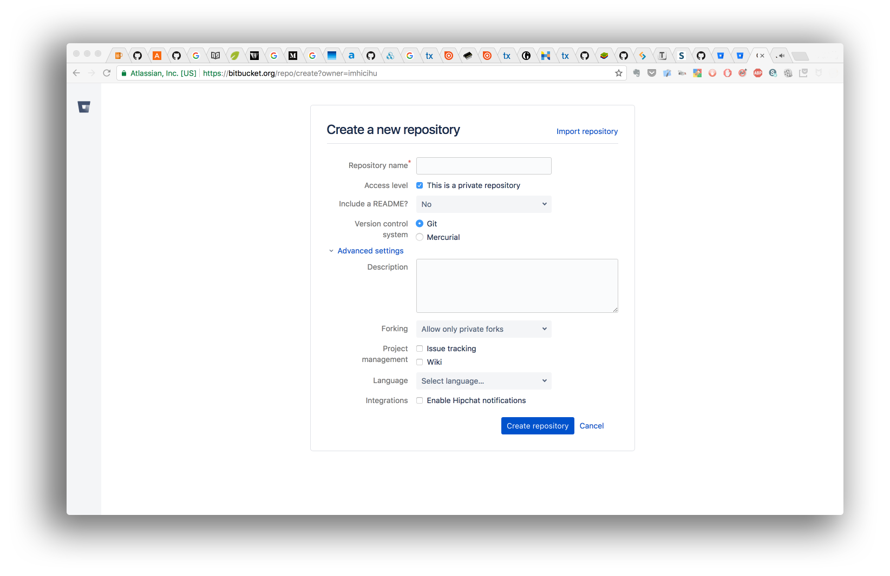

# Rationale #

* The purpose of this repository is a way of checklist when we create a brand new repository.
* This repo is a living document that will grow and adapt over time

### What is this repository for? ###

+ Quick summary
    * A _systematize-to_do-checklist_ recipe when a repository is created

### How do I get set up? ###

+ Summary of set up
    - Read our latest [checklist](Checklist.md). 
    - There are some [snippets](https://bitbucket.org/snippets/imhicihu/) created for the occasion
    - At some point, we will create a [milestone](https://bitbucket.org/site/master/issues/11528/make-milestones-and-versions-more). And then, enhance the walked road
      
+ Dependencies
    - _The less, the better_. A personal [motto](http://dictionary.cambridge.org/es/diccionario/ingles/motto)
+ Deployment instructions
    - No mandatory "_to follow_". It is a "_good practice_" exercise and follow our needs

### Contribution guidelines ###

* Writing tests
     - Fork this repo. Open an issue-pull request or just comment the workflow described. Check our [code convention](Coding_convention.md)
* Code review
     - There is no code. Just time-savers, reminders and rules of good practice to optimize _Time_ (a human creation)
* Other guidelines
     - This repo is a _massive_ guideline / [checklist](https://bitbucket.org/imhicihu/good-practices-on-repository-creation/src/master/Checklist.md)
     - There is a [code convention](https://bitbucket.org/imhicihu/good-practices-on-repository-creation/src/master/code_convention.md)
     
### Issues ###

* Check them on [here](https://bitbucket.org/imhicihu/good-practices-on-repository-creation/issues)

### Changelog ###

* Please check the [Commits](https://bitbucket.org/imhicihu/good-practices-on-repository-creation/commits/) section for the current status

### Who do I talk to? ###

* Repo owner or admin
	 - Contact `imhicihu` at `gmail` dot `com`

### Code of Conduct

* Please, check our [Code of Conduct](code_of_conduct.md)

### Legal ###

* All trademarks are the property of their respective owners.

### License ###

* The content of this project itself is licensed under the 